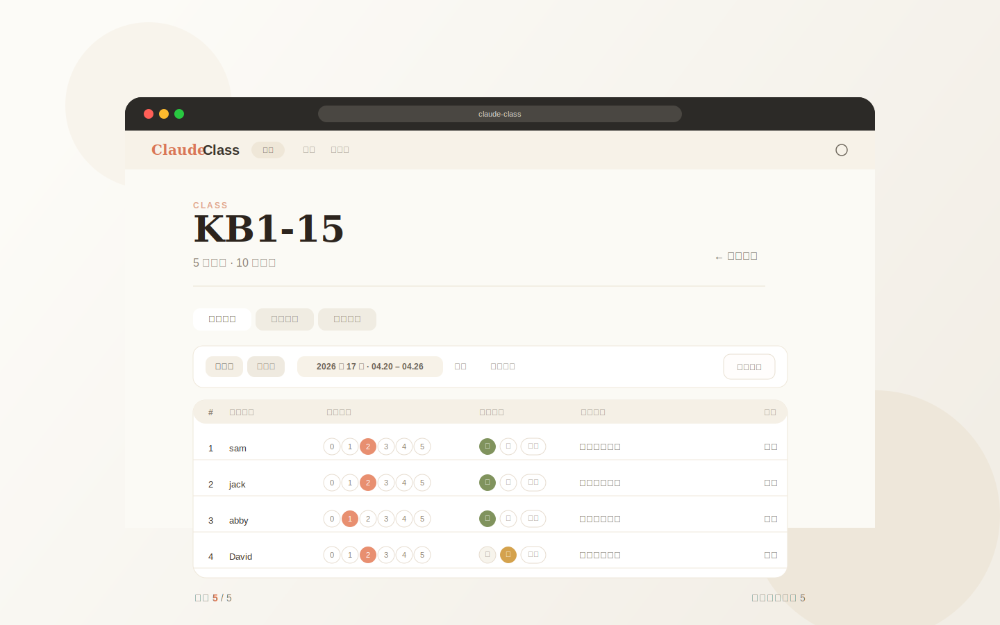

# Claude Class

A local-first classroom check-in and feedback tool for teachers.



Claude Class is a pure frontend web app for tracking student check-ins, writing short feedback, viewing weekly or monthly summaries, and exporting polished mobile-friendly report images.

Live demo: [https://yeah-ger.github.io/claude-class/](https://yeah-ger.github.io/claude-class/)

## Why This Project

Many teachers need something lighter than a full school management system:

- quick class setup
- fast weekly or monthly recording
- clear student feedback
- useful summary dashboards
- simple image export for sharing in group chats

This project focuses on that workflow and keeps everything browser-based.

## Highlights

- Local-first: all data is stored in the browser `localStorage`
- Pure static app: open `index.html` directly, no backend required
- Weekly and monthly views for classroom records
- Custom evaluation dimensions beyond the built-in fields
- Dashboard with rankings, trends, and summary metrics
- Recycle bin for deleted classes and students
- Mobile-friendly PNG export for class reports
- Export preview now matches the downloaded image output

## Best For

- teachers running small or medium-sized classes
- after-school programs and tutoring groups
- users who prefer lightweight offline-friendly tools
- educators who want a simple visual export instead of spreadsheets

## Quick Start

### Option 1: Open directly

1. Clone or download this repository
2. Open `index.html` in your browser
3. Create a class and start recording

### Option 2: Run a local static server

```bash
python3 -m http.server 8080
```

Then visit [http://localhost:8080](http://localhost:8080).

## Project Structure

```text
.
├── index.html
├── PRD.md
├── css/
│   └── style.css
├── js/
│   ├── app.js
│   ├── dashboard.js
│   ├── export.js
│   ├── record.js
│   └── store.js
└── lib/
    └── html2canvas.min.js
```

## Data and Privacy

- No server-side storage is included
- All records stay in the current browser unless the user clears site data
- If deployed with GitHub Pages or any static hosting platform, data still remains local to each visitor's browser

## Development

- No bundler required
- Main stack: HTML, CSS, vanilla JavaScript
- PNG export uses the vendored `lib/html2canvas.min.js`
- Google Fonts are referenced for the visual style; if unavailable, the app falls back to system fonts

Recommended syntax check:

```bash
for f in js/*.js; do node --check "$f" || exit 1; done
```

## Roadmap Ideas

- import and export data as JSON
- drag-and-drop student sorting
- richer monthly feedback generation
- clearer analytics wording for teacher workflows

## License

MIT. See `LICENSE`.
